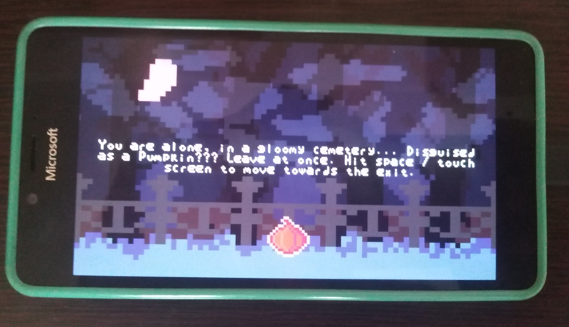
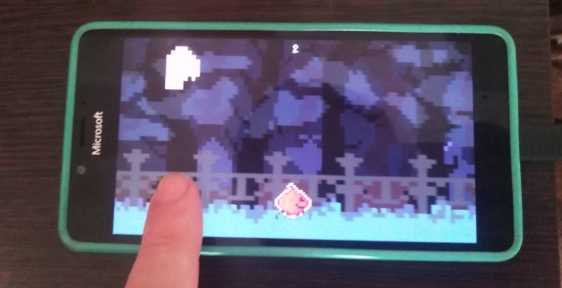

# Crawling Pumpkin - uwp branch

## Screenshot(s)

## About
My "uwp replica" of cool Crawling Pumpkin mini-game based on monogame framework ;)

## Game scenario
You are in a cemetery, inside a PUMPKIN, hehe! It's Halloween theme/time :)

## My 2 cents
- UWP + 10240 Windows SDK & Monogame 3.8 support added (for my 12-yeard old Sony Vaio notebook)))
- Micro-RnD (I specially tried DotPeek for Crawling Pumpkin R.E., and result is 0% of bugs, that's ideal automation!)))
- Kbd + TouchPanel control for all ARM/x86/x64 "os targets"! 

## References
- https://whateverdat.itch.io/crawling-pumpkin Original Crawling Pumpkin game (for desktop & web/online "game modes")
- https://whateverdat.itch.io Original Crawling Pumpkin developer

## ..
AS IS. No support. RnD only / DIY

## .
[m][e] October, 27 2024

